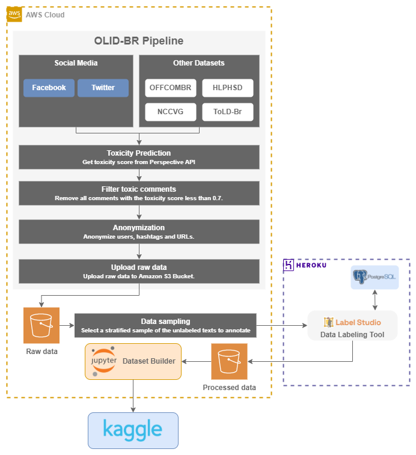

# OLID-BR

[](https://sonarcloud.io/dashboard?id=DougTrajano_olid-br)
[](LICENSE)

Offensive Language Identification Dataset for Brazilian Portuguese (OLID-BR) is a collection of portuguese text with annotations for several NLP tasks related to toxicity/offensive language.

See the [Dataset documentation](https://dougtrajano.github.io/olid-br/) for more information.

## Usage

The dataset will be available on [Kaggle](https://www.kaggle.com/dougtrajano/olidbr).

The above sample code shows how to use the dataset.

```python
# Define Kaggle required env vars
import os

os.environ["KAGGLE_USERNAME"] = "your_username"
os.environ["KAGGLE_KEY"] = "your_kaggle_key"

# Download the dataset
from kaggle.api.kaggle_api_extended import KaggleApi

kaggle = KaggleApi()
kaggle.authenticate()

kaggle.dataset_download_file(
    dataset="olidbr",
    file_name="olidbr.csv")

df = pd.read_csv("olidbr.csv")
```

## Technical details

### Running Notebooks

To run the extraction notebooks, you must have to follow the above steps:

#### Environment Variables

Create a `.env` file with the following variables:

<details><summary>Environment Variables</summary>
<p>

| Variable | Description | Default | Required |
| --- | --- | --- | --- |
| `AWS_ROLE_ARN` | AWS Role ARN | `None` | Optional |
| `AWS_WEB_IDENTITY_TOKEN_FILE` | AWS Web Identity Token File | `None` | Optional |
| `AWS_ACCESS_KEY_ID` | AWS Access Key ID | `None` | Optional |
| `AWS_SECRET_ACCESS_KEY` | AWS Secret Access Key | `None` | Optional |
| `AWS_S3_BUCKET` | AWS S3 Bucket | `None` | Required |
| `AWS_S3_BUCKET_PREFIX` | AWS S3 Bucket Prefix | `None` | Required |
| `LOG_LEVEL` | Log level | `INFO` | Optional |
| `PERSPECTIVE_API_KEY` | Perspective API Key | `None` | Required |
| `PERSPECTIVE_THRESHOLD` | Perspective Threshold | `0.5` | Optional |
| `FILTER_TOXIC_COMMENTS` | Filter Toxic Comments | `True` | Optional |
| `TWITTER_CONSUMER_KEY` | Twitter Consumer Key | `None` | Required |
| `TWITTER_CONSUMER_SECRET` | Twitter Consumer Secret | `None` | Required |
| `TWITTER_ACCESS_TOKEN` | Twitter Access Token | `None` | Required |
| `TWITTER_ACCESS_TOKEN_SECRET` | Twitter Access Token Secret | `None` | Required |
| `TWITTER_MAX_TWEETS` | Twitter Max Tweets or replies | `None` | Required |
| `YOUTUBE_API_KEY` | YouTube API Key | `None` | Required | `YOUTUBE_MAX_COMMENTS` | YouTube Max Comments | 50 | Optional |
| `YOUTUBE_MAX_COMMENTS_PER_VIDEO` | YouTube Max Comments per video | `None` | Optional |

If `AWS_ROLE_ARN` and `AWS_WEB_IDENTITY_TOKEN_FILE` are provided, the crawler will use them to assume a role, and will not use `AWS_ACCESS_KEY_ID`, and `AWS_SECRET_ACCESS_KEY`.

</p>
</details>

### Install dependencies

```bash
pip install -r requirements.txt
```

<details><summary>Architecture</summary>
<p>



</p>
</details>

## Changelog

See the [GitHub Releases](https://github.com/DougTrajano/toxicity-crawler/releases) page for a history of notable changes to this project.

## License

The project is licensed under the [Apache 2.0 License](LICENSE).
