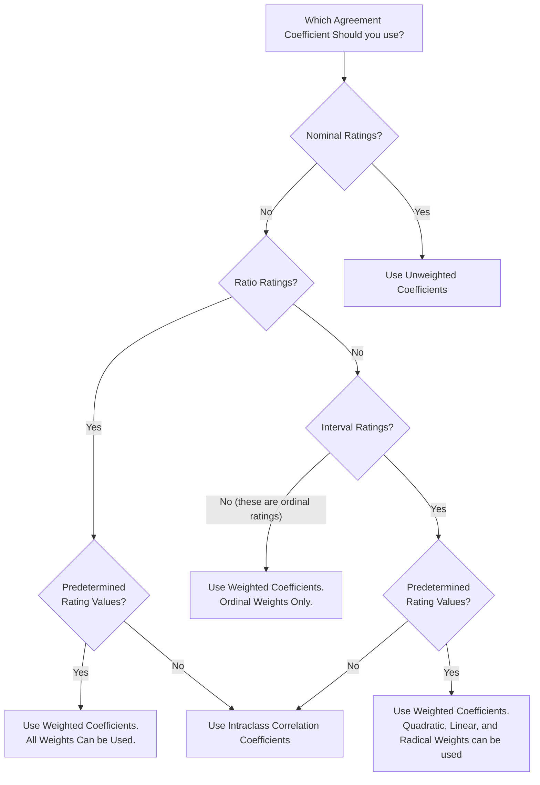

# Inter-Rater Reliability

The Inter-Rater Reliability is an important part of the process of evaluating the quality of the annotations. In this section, we will present the metrics and the methodology used in this process.

Each comment was tagged by three different raters. So, we need to consider metrics that supports more than two raters.

## How we selected the coefficients?

In the Handbook of Inter-Rater Reliability[^1], Gwet, K.L. proposed a diagram that helps to choose the correct agreement coefficient for each study.

All our ratings are [**nominal**]{A type of data that is used to label variables without providing any quantitative value.|top-right}, then we will see **Unweighted Coefficients** proposed by Gwet, K.L. in the book.

- **Percent Agreement** ($p_a$): Not corrected for chance-agreement.
- **Fleiss' Generalized Kappa** ($\hat{K}_F$): Good sometimes - Exposed to severe paradoxes.
- **Conger's Generalized Kappa** ($\hat{K}_C$): Good sometimes - Exposed to severe paradoxes.
- **Gwet's AC1** ($\hat{K}_G$): More paradox-resistant than alternative coefficients.
- **Brennan-Prediger** ($\hat{K}_{BP}$): More paradox-resistant than alternative coefficients.
- **Krippendorff's Alpha** ($\hat{\alpha}_K$) Similar to Fleiss' Generalized Kappa - Minor differences.

Di Eugenio & Glass (2004)[^7] argue that using multiple reliability metrics with different methods for computing $p_{(A_e)}$ can be more revealing of than a single metric. So, we will select a range of metrics to use in our analysis.

### The Simplicity of the Percent Agreement

Because percent agreement is figured as an average across observations it can hide important
disagreements.

> "Averages over all categories of a variable… hide unreliable categories behind reliable ones” - Krippendorff[^5]

> "when all coders use only one category, there is no variation and hence no evidence of reliability" - Krippendorff[^6]

To remedy this he suggests that in some cases it is appropriate to conduct multiple tests within a single variable.

> "All distinctions that matter should be tested for their reliability" - Krippendorff[^6]

### The Kappa paradoxes

Kappa often yields coefficients that are unexpectedly low when compared to the percent agreement. This problem has been referred to in the literatura as the Kappa paradoxes. Feinstein and Cicchetti (1990)[^4] provides a detailed explanation about two such paradoxes. These authors made the following two statements:

- "The first paradox of $k$ (Kappa) is that if $p_e$ (the percent chance agreement) is large, the correction process can convert a relatively high value of $p_0$ to a relatively low value of $k$" (Feinstein & Cicchetti, (1990, p. 544)[^4]
- "The second paradox occurs when unbalanced marginal totals produce higher values of $k$ than more balanced totals." (Feinstein & Cicchetti, (1990, p. 545)[^4]

So, we will use the [Percent Agreement](#percent-agreement), [Gwet's AC1](#gwets-ac1), and [Krippendorff's Alpha](#krippendorffs-alpha) as the coefficients to evaluate the quality of the annotations.

## Selected coefficients

### Percent agreement

The Percent Agreement is a measure of the agreement between the raters. It's calculated by dividing the number of agreeing comments by the total number of comments as follows:

$$
p_a = \frac{n_{\text{agreeing}}}{n_{\text{total}}}
$$

**Interpretation**

| Slight | Fair | Moderate | Substantial | Almost perfect |
| :----: | :---: | :-----: | :---------: | :------------: |
| 0.01 - 0.20 | 0.21 - 0.40 | 0.41 - 0.60 | 0.61 - 0.80 | 0.81 - 0.99 |

### Gwet’s AC1

Gwet[^2] recommended an agreement coefficient named AC1, which was developed to overcome many of the limitations associated with Kappa-based agreement coefficients. Gwet's AC1 is based on the same percent agreement equation than Kappa, and on a new percent chance agreement as $p_e$.

The Gwet's AC1 coefficient, denoted here by $\hat{K}_G$ is formally defined as follows:

$$
\widehat{\kappa}_{\mathrm{G}}=\frac{p_{a}-p_{e}}{1-p_{e}}, \text { where } p_{e}=\frac{1}{q(q-1)} \sum_{k=1}^{q} \hat{\pi}_{k}\left(1-\hat{\pi}_{k}\right)
$$

where $\hat{\pi}_{k}$ is given by the following equation:

$$
\hat{\pi}_{k}=\frac{1}{n} \sum_{i=1}^{n} \frac{r_{i k}}{r_{i}}
$$

**Interpretation**

| Poor | Fair | Moderate | Substantial | Almost perfect |
| :--: | :--: | :------: | :---------: | :------------: |
| < 0.20 | 0.21 - 0.40 | 0.41 - 0.60 | 0.61 - 0.80 | 0.81 - 0.99 |

### Krippendorff's Alpha

Krippendorff's Alpha[^3] is a versatile statistic that assesses the agreement achieved among observers who categorize, evaluate, or measure a given set of objects in terms of the values of a variable. It generalizes several specialized agreement coefficients by accepting any number of observers, being applicable to nominal, ordinal, interval, and ratio levels of measurement, being able to handle missing data, and being corrected for small sample sizes.

Krippendorff's coefficient is calculated as follows:

$$
\widehat{\alpha}_{\mathrm{K}}=\frac{p_{a}^{\prime}-p_{e}}{1-p_{e}}, \text { where } p_{e}=\sum_{k=1}^{q} \hat{\pi}_{k}^{2}
$$

where $p_{a}$ is given by:

$$
p_{a}=\frac{1}{n^{\prime}} \sum_{i=1}^{n^{\prime}} \sum_{k=1}^{q} \frac{r_{i k}\left(r_{i k}-1\right)}{r_{i}\left(r_{i}-1\right)}
$$

and $p_{a}^{\prime}$ is given by:

$$
p_{a}^{\prime}=\left(1-\varepsilon_{n}\right) p_{a}+\varepsilon_{n}
$$

**Interpretation**

| Poor | Slight | Fair | Moderate | Substantial | Almost perfect |
| :-: | :-: | :-: | :-: | :-: | :-: |
| < 0 | 0.01 - 0.20 | 0.21 - 0.40 | 0.41 - 0.60 | 0.61 - 0.80 | 0.81 - 0.99 |

[^1]: Gwet, Kilem L. Handbook of inter-rater reliability: The definitive guide to measuring the extent of agreement among raters. Advanced Analytics, LLC, 2014.
[^2]: Gwet, Kilem Li. "Computing inter‐rater reliability and its variance in the presence of high agreement." British Journal of Mathematical and Statistical Psychology 61.1 (2008): 29-48.
[^3]: Hayes, Andrew F., and Klaus Krippendorff. "Answering the call for a standard reliability measure for coding data." Communication methods and measures 1.1 (2007): 77-89.
[^4]: Feinstein, Alvan R., and Domenic V. Cicchetti. "High agreement but low kappa: I. The problems of two paradoxes." Journal of clinical epidemiology 43.6 (1990): 543-549.
[^5]: Krippendorff, Klaus. Content analysis: An introduction to its methodology. Sage publications, 2018.
[^6]: Krippendorff, K. "Some Common Misconceptions and Recommendations." Human Communication Research 30 (2004): 411-433.
[^7]: Eugenio, Barbara Di, and Michael Glass. "The kappa statistic: A second look." Computational linguistics 30.1 (2004): 95-101.
