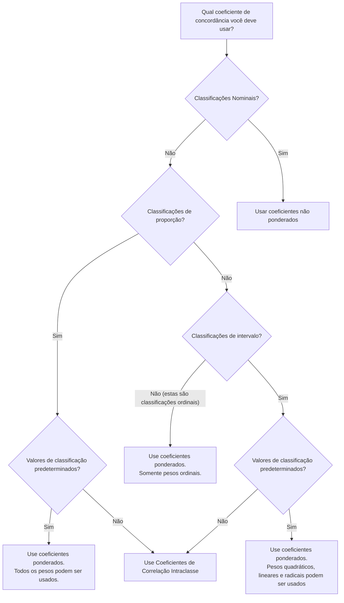

# Confiabilidade entre avaliadores

A confiabilidade entre avaliadores é uma parte importante do processo de avaliação da qualidade das anotações. Nesta seção, apresentaremos as métricas e a metodologia utilizada neste processo.

Cada comentário foi marcado por três avaliadores diferentes. Portanto, precisamos considerar métricas que suportem mais de dois avaliadores.

## Como definimos as métricas?

No Handbook of Inter-Rater Reliability[^1], Gwet, K.L. propôs um diagrama que ajuda a escolher o coeficiente de concordância correto para cada estudo de confiabilidade entre avaliadores.

Todas as nossas classificações são do tipo [***nominal***]{Um tipo de dado usado para rotular variáveis ​​sem fornecer nenhum valor quantitativo.|top-right}, então veremos **Coeficientes não ponderados** propostos por Gwet, K.L. no livro.

- **Percent Agreement** ($p_a$): Não corrigido para concordância por acaso.
- **Fleiss' Generalized Kappa** ($\hat{K}_F$): Bom às vezes - Exposto a graves paradoxos.
- **Conger's Generalized Kappa** ($\hat{K}_C$): Bom às vezes - Exposto a paradoxos severos.
- **Gwet's AC1** ($\hat{K}_G$): Mais resistente a paradoxos do que coeficientes alternativos.
- **Brennan-Prediger** ($\hat{K}_{BP}$): Mais resistente a paradoxos do que coeficientes alternativos.
- **Krippendorff's Alpha** ($\hat{\alpha}_K$) Semelhante ao Kappa Generalizado de Fleiss - Diferenças menores.

Di Eugenio & Glass (2004)[^7] argumentam que o uso de várias métricas de confiabilidade com diferentes métodos para calcular $p_{(A_e)}$ pode ser mais revelador do que uma única métrica. Assim, selecionaremos uma série de métricas para usar em nossa análise.

### A simplicidade de Percent Agreement

Como a *Percent Agreement* é calculada como uma média entre as observações, ela pode ocultar importantes desacordos.

> "Averages over all categories of a variable… hide unreliable categories behind reliable ones” - Krippendorff[^5]

> "when all coders use only one category, there is no variation and hence no evidence of reliability" - Krippendorff[^6]

Para remediar isso, ele sugere que, em alguns casos, é apropriado realizar vários testes dentro de uma única variável.

> "All distinctions that matter should be tested for their reliability" - Krippendorff[^6]

### Os paradoxos do Kappa

Kappa geralmente produz coeficientes inesperadamente baixos quando comparados com a porcentagem de concordância. Este problema tem sido referido na literatura como os paradoxos Kappa. Feinstein e Cicchetti (1990)[^4] fornecem uma explicação detalhada sobre dois desses paradoxos. Esses autores fizeram as duas seguintes afirmações:

- "O primeiro paradoxo de $k$ (Kappa) é que se $p_e$ (a porcentagem de concordância) for grande, o processo de correção pode converter um valor relativamente alto de $p_0$ em um valor relativamente baixo de $k$" (Feinstein & Cicchetti, (1990, p. 544)[^4]
- "O segundo paradoxo ocorre quando totais marginais desbalanceados produzem valores maiores de $k$ do que totais mais balanceados." (Feinstein & Cicchetti, (1990, p. 545)[^4]

Portanto, usaremos [Percent Agreement](#percent-agreement), [Gwet's AC1](#gwets-ac1) e [Krippendorff's Alpha](#krippendorffs-alpha) como coeficientes para avaliar a qualidade das anotações.

## Coeficientes selecionados

### Percent agreement

O *Percent agreement* (percentual de acordo) é uma medida do acordo entre os avaliadores. É calculado dividindo o número de comentários concordantes pelo número total de comentários da seguinte forma:

$$
p_a = \frac{n_{\text{concordando}}}{n_{\text{total}}}
$$

**Interpretação**

| Ruim | Leve | Moderado | Substancial | Quase perfeito |
| :-: | :-: | :-: | :-: | :-: |
| 0,01 - 0,20 | 0,21 - 0,40 | 0,41 - 0,60 | 0,61 - 0,80 | 0,81 - 0,99 |

### Gwet's AC1

Gwet[^2] recomendou um coeficiente de concordância chamado AC1, que foi desenvolvido para superar muitas das limitações associadas aos coeficientes de concordância baseados em Kappa. A AC1 de Gwet é baseada na mesma equação percentual de concordância que Kappa, mas com um novo percentual de chance de concordância como $p_e$.

O Gwet's AC1 coefficient, denotado aqui por $\hat{K}_G$, é formalmente definido da seguinte forma:

$$
\widehat{\kappa}_{\mathrm{G}}=\frac{p_{a}-p_{e}}{1-p_{e}}, \text { onde } p_{e}=\frac{ 1}{q(q-1)} \sum_{k=1}^{q} \hat{\pi}_{k}\left(1-\hat{\pi}_{k}\right)
$$

onde $\hat{\pi}_{k}$ é dado pela seguinte equação:

$$
\hat{\pi}_{k}=\frac{1}{n} \sum_{i=1}^{n} \frac{r_{i k}}{r_{i}}
$$

**Interpretação**

| Ruim | Leve | Moderado | Substancial | Quase perfeito |
| :-: | :-: | :-: | :-: | :-: |
| < 0,20 | 0,21 - 0,40 | 0,41 - 0,60 | 0,61 - 0,80 | 0,81 - 0,99 |

### Krippendorff's Alpha

O *Krippendorff's Alpha*[^3] é uma estatística versátil que avalia a concordância alcançada entre observadores que categorizam, avaliam ou medem um determinado conjunto de objetos em termos dos valores de uma variável. Ele generaliza vários coeficientes de concordância especializados aceitando qualquer número de observadores, sendo aplicável a níveis de medição nominais, ordinais, intervalares e de razão, sendo capaz de lidar com dados ausentes e sendo corrigido para pequenos tamanhos de amostra.

O coeficiente de Krippendorff é calculado da seguinte forma:

$$
\widehat{\alpha}_{\mathrm{K}}=\frac{p_{a}^{\prime}-p_{e}}{1-p_{e}}, \text { onde } p_{e }=\sum_{k=1}^{q} \hat{\pi}_{k}^{2}
$$

onde $p_{a}$ é dado por:

$$
p_{a}=\frac{1}{n^{\prime}} \sum_{i=1}^{n^{\prime}} \sum_{k=1}^{q} \frac{r_{ i k}\left(r_{i k}-1\right)}{r_{i}\left(r_{i}-1\right)}
$$

e $p_{a}^{\prime}$ é dado por:

$$
p_{a}^{\prime}=\left(1-\varepsilon_{n}\right) p_{a}+\varepsilon_{n}
$$

**Interpretação**

| Ruim | Leve | Regular | Moderado | Substancial | Quase perfeito |
| :-: | :-: | :-: | :-: | :-: | :-: |
| <0 | 0,01 - 0,20 | 0,21 - 0,40 | 0,41 - 0,60 | 0,61 - 0,80 | 0,81 - 0,99 |

[^1]: Gwet, Kilem L. Manual de confiabilidade entre avaliadores: O guia definitivo para medir a extensão da concordância entre os avaliadores. Advanced Analytics, LLC, 2014.
[^2]: Gwet, Kilem Li. "Computando a confiabilidade entre avaliadores e sua variação na presença de alta concordância." British Journal of Mathematical and Statistical Psychology 61.1 (2008): 29-48.
[^3]: Hayes, Andrew F. e Klaus Krippendorff. "Atendendo ao pedido de uma medida de confiabilidade padrão para codificação de dados." Métodos e medidas de comunicação 1.1 (2007): 77-89.
[^4]: Feinstein, Alvan R., and Domenic V. Cicchetti. "High agreement but low kappa: I. The problems of two paradoxes." Journal of clinical epidemiology 43.6 (1990): 543-549.
[^5]: Krippendorff, Klaus. Content analysis: An introduction to its methodology. Sage publications, 2018.
[^6]: Krippendorff, K. "Some Common Misconceptions and Recommendations." Human Communication Research 30 (2004): 411-433.
[^7]: Eugenio, Barbara Di, and Michael Glass. "The kappa statistic: A second look." Computational linguistics 30.1 (2004): 95-101.
