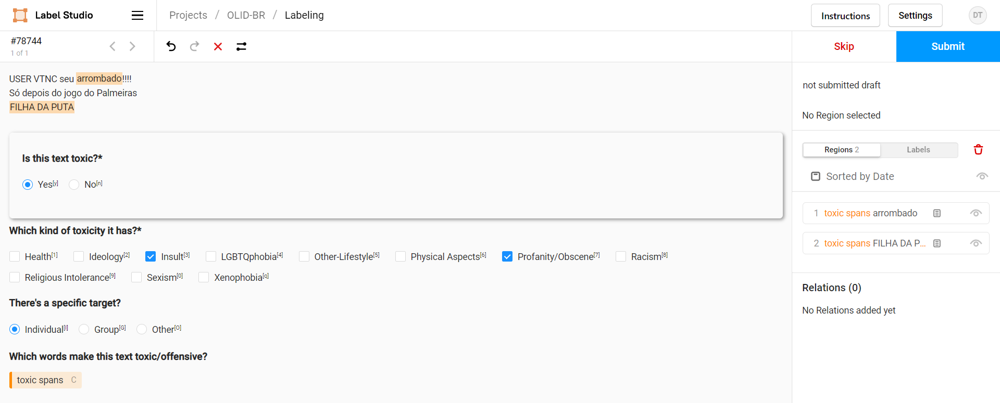

# Schema

We developed the annotation schema to maximize the annotator's efficiency.

OLID-BR contains a collection of annotated sentences in Brazilian Portuguese using an annotation model that encompasses the following levels:

- [[Offensive content detection](#offensive-content-detection)]{Detect offensive content in sentences and categorize it.|top-right}
- [[Offense target identification](#offense-target-identification)]{Detect if an offensive sentence is targeted to a person or group of people.|top-right}
- [[Offensive spans identification](#offensive-spans-identification)]{Detect curse words in sentences.|top-right}

<figure>
  
  <figcaption>Hierarchical taxonomy for categorizing offensive language, proposed by author.</figcaption>
</figure>

To achieve this, we defined 4 questions that our [**qualified annotators**](qualified-annotators.en.md) will answer to each sentence.

- Is this text toxic?
- Which kind of toxicity it has?
- There's a specific target?
- Which words make this text toxic/offensive?

The following image shows the annotation screen that our annotators will see.

<figure>
  
  <figcaption>Labeling Interface - Label Studio</figcaption>
</figure>
