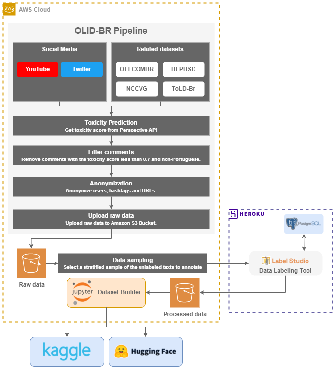

# Data Pipeline

In this section, we describe the [**data pipeline**]{A data pipeline is a series of data processing steps.} used to generate the dataset.

## Data Source

We collected comments from different sources, such as [**Twitter**]{Twitter is a microblogging and social networking service.}, [**YouTube**]{YouTube is a video-sharing website.}, and related datasets.

For each social media (Twitter and YouTube), we defined a set of public profiles that we considered relevant to the topic.

Additionally, we used Brazilian texts from other datasets, such as:

- [rogersdepelle/OffComBR: Here we provide a data set of web comments which have been annotated for hate speech.](https://github.com/rogersdepelle/OffComBR)
- [paulafortuna/Portuguese-Hate-Speech-Dataset: A Hierarchically-Labeled Portuguese Hate Speech Dataset](https://github.com/paulafortuna/Portuguese-Hate-Speech-Dataset)
- [LaCAfe/Dataset-Hatespeech: Hate Speech Detection Dataset](https://github.com/LaCAfe/Dataset-Hatespeech)
- [JAugusto97/ToLD-Br: Toxic Language Detection in Social Media for Brazilian Portuguese: New Dataset and Multilingual Analysis](https://github.com/JAugusto97/ToLD-Br)

## Architecture

The following diagram shows the architecture of the [**data pipeline**]{A data pipeline is a series of data processing steps.}.

<figure>
  
  <figcaption>Architecture - Image by author.</figcaption>
</figure>

## Filtering

We want to filter out comments that are not relevant to the scope of the dataset.

- Comments must be in Portuguese.
- Comments that have one or more related keywords.

## Privacy

We will apply some privacy policies to the comments collected from each source directly in the ingestion pipeline.

- User mentions were replaced with the word "@USER".
- URLs were replaced with the word "URL".
