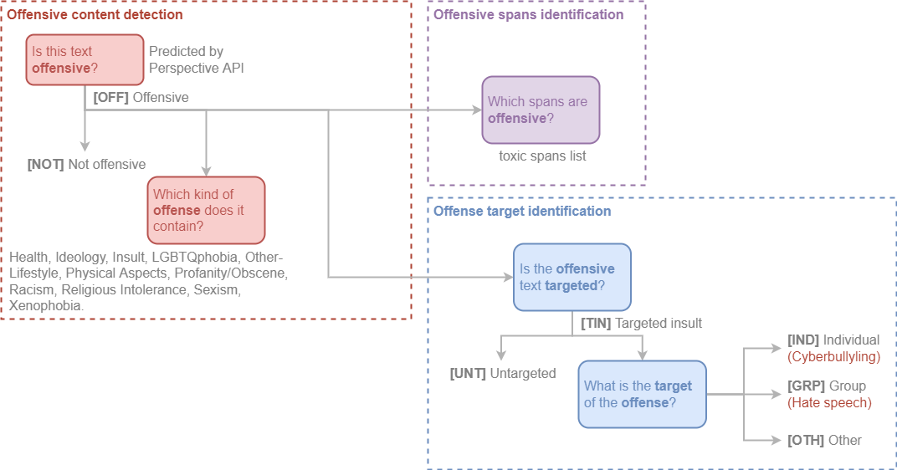

# OLID-BR

Offensive Language Identification Dataset for Brazilian Portuguese (OLID-BR) is a dataset with multi-task annotations for the detection of offensive language.

The current version (v1.0) contains 7,943 comments from different sources, including social media (YouTube and Twitter) and related datasets.

OLID-BR contains a collection of annotated sentences in Brazilian Portuguese using an annotation model that encompasses the following levels:

- [[Offensive content detection](#offensive-content-detection)]{Detect offensive content in sentences and categorize it.|top-right}
- [[Offense target identification](#offense-target-identification)]{Detect if an offensive sentence is targeted to a person or group of people.|top-right}
- [[Offensive spans identification](#offensive-spans-identification)]{Detect curse words in sentences.|top-right}

<figure>
  
  <figcaption>Hierarchical taxonomy for categorizing offensive language. Proposed by author, adapted from <a href="https://arxiv.org/abs/1902.09666" target="_blank">Zampieri et al. (2019)</a>.</figcaption>
</figure>

## Categorization

### Offensive content detection

This level is used to detect offensive content in the sentence.

**Is this text offensive?**

We use the [[Perspective API](https://www.perspectiveapi.com/)]{Perspective API is the product of a collaborative research effort by Jigsaw and Google's Counter Abuse Technology team.|top-right} to detect if the sentence contains offensive content with double-checking by our [qualified annotators](annotation/index.en.md#who-are-qualified-annotators).

- `OFF` Offensive: Inappropriate language, insults, or threats.
- `NOT` Not offensive: No offense or profanity.

**Which kind of offense does it contain?**

The following labels were tagged by our annotators:

`Health`, `Ideology`, `Insult`, `LGBTQphobia`, `Other-Lifestyle`, `Physical Aspects`, `Profanity/Obscene`, `Racism`, `Religious Intolerance`, `Sexism`, and `Xenophobia`.

See the [Glossary](glossary.en.md) for further information.

### Offense target identification

This level is used to detect if an offensive sentence is targeted to a person or group of people.

**Is the offensive text targeted?**

- `TIN` Targeted Insult: Targeted insult or threat towards an individual, a group or other.
- `UNT` Untargeted: Non-targeted profanity and swearing.

**What is the target of the offense?**

- `IND` The offense targets an individual, often defined as “cyberbullying”.
- `GRP` The offense targets a group of people based on ethnicity, gender, sexual
- `OTH` The target can belong to other categories, such as an organization, an event, an issue, etc.

### Offensive spans identification

As toxic span, we define a sequence of words that attribute to the text's toxicity.

For example, let's consider the following text:

> "USER `Canalha` URL"

The toxic spans are:

```python
[5, 6, 7, 8, 9, 10, 11, 12, 13]
```

## OLID (English)

The OLID (with English comments) was a reference dataset for OLID-BR. It contains 14,100 annotate tweets using a hierarchical annotation. Each instance contains up to 3 labels each corresponding to one of the following levels:

- Level A: Offensive Language Detection
- Level B: Categorization of Offensive Language
- Level C: Offensive Language Target Identification

<figure>
  
  <figcaption>The three-level hierarchical taxonomy for categorizing offensive language. Proposed by <a href="https://arxiv.org/abs/1902.09666" target="_blank">Zampieri et al. (2019)</a>.</figcaption>
</figure>

OLID was used in the [OffensEval: Identifying and Categorizing Offensive Language in Social Media (SemEval 2019 - Task 6)](https://competitions.codalab.org/competitions/20011) shared task.

### How dataset was generated?

The examples were retrieved from Twitter using the [Twitter API](https://developer.twitter.com/en/docs/tweets/search/api-reference/get-search-tweets) and searching for keywords and constructions that are often included in offensive messages, see the table below for the list of keywords:

| Keyword | Offensive % |
| :-----: | :---------: |
| medical marijuana | 0.0 |
| they are | 5.9 |
| to:NewYorker | 8.3 |
| you are | 21.0 |
| she is | 26.6 |
| to:BreitBartNews | 31.6 |
| he is | 32.4 |
| gun control | 34.7 |
| -filter:safe | 58.9 |
| conservatives | 23.2 |
| antifa | 26.7 |
| MAGA | 27.7 |
| liberals | 38.0 |

The keyword that resulted in the highest concentration of offensive content was the Twitter "safe" filter, corresponding to tweets that were flagged as unsafe by Twitter (the "-" symbol indicates "not safe").

The dataset was annotated using crowdsourcing. The gold labels were assigned considering the agreement of three annotators. No correction has been carried out on the crowdsourcing annotations.

Twitter user mentions were substituted by @USER and URLs have been substituted by URL.

### Data summary

| A | B | C | Training | Test | Total |
| : | : | : | :------: | :--: | :---: |
| OFF | TIN | IND | 2,407 | 100 | 2,507 |
| OFF | TIN | OTH | 395 | 35 | 430 |
| OFF | TIN | GRP | 1,074 | 78 | 1,152 |
| OFF | UNT | — | 524 | 27 | 551 |
| NOT | — | — | 8,840 | 620 | 9,460 |
| All | | | 13,240 | 860 | 14,100 |

[^1]: Zampieri et al. "Predicting the type and target of offensive posts in social media." NAACL 2019.
[^2]: João A. Leite, Diego F. Silva, Kalina Bontcheva, Carolina Scarton (2020): Toxic Language Detection in Social Media for Brazilian Portuguese: New Dataset and Multilingual Analysis. Published at AACL-IJCNLP 2020.
[^3]: S. Malmasi, "Offensive Language Identification Dataset - OLID", Scholar.harvard.edu, 2021. [Online]. Available: https://scholar.harvard.edu/malmasi/olid. [Accessed: 28- Aug- 2021].
[^4]: Weng, L. (2021, March 21). Reducing toxicity in language models. Lil'Log. https://lilianweng.github.io/lil-log/2021/03/21/reducing-toxicity-in-language-models.html.
