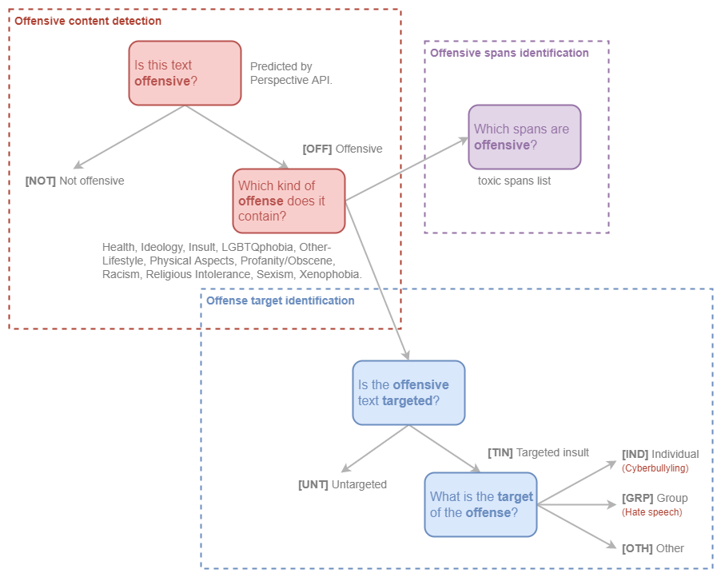
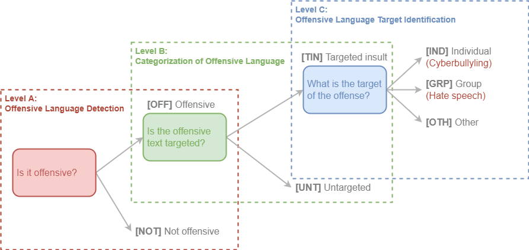

# OLID-BR

OLID-BR contém uma coleção de comentários em Português do Brasil anotados que abrangem os seguintes níveis:

- [[Offensive content detection](#offensive-content-detection)]{Detect offensive content in sentences and categorize it.|top-right}
- [[Offense target identification](#offense-target-identification)]{Detect if an offensive sentence is targeted to a person or group of people.|top-right}
- [[Offensive spans identification](#offensive-spans-identification)]{Detect curse words in sentences.|top-right}

<figure>
  
  <figcaption>Taxonomia hierárquica para categorizar linguagem ofensiva, proposta pelo autor.</figcaption>
</figure>

## Categorização

### Offensive content detection

Este nível é usado para detectar conteúdo ofensivo em uma frase.

#### Este texto é ofensivo?

Nós utilizamos a [[Perspective API](https://www.perspectiveapi.com/)]{A Perspective API é o produto de um esforço de pesquisa colaborativo da Jigsaw e da equipe de tecnologia de combate ao abuso do Google.|top-right} para detectar se um comentário é ofensivo ou não. Adicionalmente, nossos anotadores reclassificaram comentários identificados como ofensivos incorretamente.

- `OFF`: O comentário é ofensivo.
- `NOT`: O comentário não é ofensivo.

#### Qual tipo de ofensa o texto contém?

Os rótulos abaixo foram anotados pelos nossos anotadores.

`Health`, `Ideology`, `Insult`, `LGBTQphobia`, `Other-Lifestyle`, `Physical Aspects`, `Profanity/Obscene`, `Racism`, `Religious Intolerance`, `Sexism` e `Xenophobia`.

Veja [Glossary](glossary.pt.md) para maiores informações.

### Offense target identification

Este nível é usado para detectar se um comentário ofensivo é direcionado a um indivíduo, grupo de pessoas ou outros.

#### Este comentário ofensivo é direcionado a alguém?

- `TIN`: O comentário é direcionado a um indivíduo, grupo de pessoas ou outros.
- `UNT`: O comentário não é direcionado.

#### Qual o alvo do comentário ofensivo?

- `IND`: O comentário é direcionado a um indivíduo. Também conhecido como *Cyberbullying*.
- `GRP`: O comentário é direcionado a um grupo de pessoas. Também conhecido como *Hate Speech*.
- `OTH`: O comentário é direcionado a outras categorias, como uma organização, um evento, etc.

### Offensive spans identification

Os *toxic spans* fornecem uma lista com os caracteres de um determinado comentário que são considerados ofensivos.

Por exemplo, vamos considerar o comentário:

> "USER `Canalha` URL"

Os toxic spans são:

```python
[5, 6, 7, 8, 9, 10, 11, 12, 13]
```

## OLID (Inglês)

O OLID (com comentários em inglês) foi um dataset referência para o OLID-BR. Ele contém 14.100 comentários anotados usando uma anotação hierárquica. Cada instância contém até 3 rótulos cada um correspondente a um dos seguintes níveis:

- Level A: Offensive Language Detection
- Level B: Categorization of Offensive Language
- Level C: Offensive Language Target Identification

<figure>
  
  <figcaption>The three-level hierarchical taxonomy for categorizing offensive language, proposed by <a href="https://arxiv.org/abs/1902.09666" target="_blank">Zampieri et al. (2019)</a>.</figcaption>
</figure>

OLID foi usado como dataset de benchmark em [OffensEval: Identifying and Categorizing Offensive Language in Social Media (SemEval 2019 - Task 6)](https://competitions.codalab.org/competitions/20011).

### Como o dataset foi gerado?

Os exemplos foram obtidos a partir do Twitter usando a [Twitter API](https://developer.twitter.com/en/docs/tweets/search/api-reference/get-search-tweets) e procurando por palavras-chave e construções que são frequentemente incluídas em mensagens ofensivas, veja a tabela abaixo para a lista de palavras-chave:

| Keyword | Offensive % |
| :-----: | :---------: |
| medical marijuana | 0.0 |
| they are | 5.9 |
| to:NewYorker | 8.3 |
| you are | 21.0 |
| she is | 26.6 |
| to:BreitBartNews | 31.6 |
| he is | 32.4 |
| gun control | 34.7 |
| -filter:safe | 58.9 |
| conservatives | 23.2 |
| antifa | 26.7 |
| MAGA | 27.7 |
| liberals | 38.0 |

A palavra-chave que resultou na maior concentração de linguagem ofensiva foi a palavra-chave "safe", que corresponde aos tweets que foram marcados como seguros pelo Twitter (o símbolo ‘-’ indica ‘não seguro’).

O dataset foi anotado por crowdsourcing. Os *gold labels* foram atribuídos levando em consideração o acordo de três anotadores. Nenhuma correção foi realizada nas anotações do crowdsourcing.

Os usuários que foram mencionados no Twitter foram substituídos por @USER. As URLs foram substituídas por URL.

### Resumo dos dados

| A | B | C | Training | Test | Total |
| : | : | : | :------: | :--: | :---: |
| OFF | TIN | IND | 2,407 | 100 | 2,507 |
| OFF | TIN | OTH | 395 | 35 | 430 |
| OFF | TIN | GRP | 1,074 | 78 | 1,152 |
| OFF | UNT | — | 524 | 27 | 551 |
| NOT | — | — | 8,840 | 620 | 9,460 |
| All | | | 13,240 | 860 | 14,100 |

[^1]: Zampieri et al. "Predicting the type and target of offensive posts in social media." NAACL 2019.
[^2]: João A. Leite, Diego F. Silva, Kalina Bontcheva, Carolina Scarton (2020): Toxic Language Detection in Social Media for Brazilian Portuguese: New Dataset and Multilingual Analysis. Published at AACL-IJCNLP 2020.
[^3]: S. Malmasi, "Offensive Language Identification Dataset - OLID", Scholar.harvard.edu, 2021. [Online]. Available: https://scholar.harvard.edu/malmasi/olid. [Accessed: 28- Aug- 2021].
[^4]: Weng, L. (2021, March 21). Reducing toxicity in language models. Lil'Log. https://lilianweng.github.io/lil-log/2021/03/21/reducing-toxicity-in-language-models.html.
