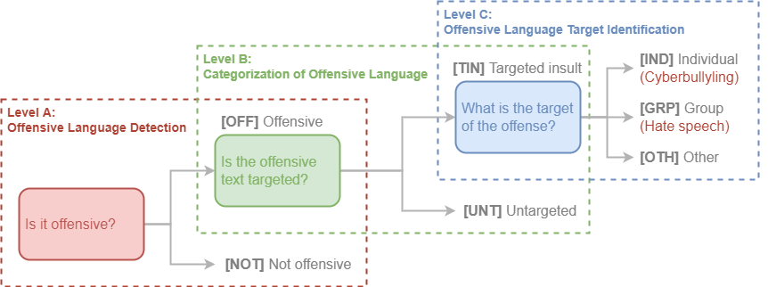

# OLID v1.0

OLID was a reference dataset for OLID-BR.

OLID contains 14,100 annotate tweets using a hierarchical annotation. Each instance contains up to 3 labels each corresponding to one of the following levels:

- Level A: Offensive Language Detection
- Level B: Categorization of Offensive Language
- Level C: Offensive Language Target Identification

<figure>
  
  <figcaption>The three-level hierarchical taxonomy for categorizing offensive language, proposed by <a href="https://arxiv.org/abs/1902.09666" target="_blank">Zampieri et al. (2019)</a>.</figcaption>
</figure>

OLID was used in the [OffensEval: Identifying and Categorizing Offensive Language in Social Media (SemEval 2019 - Task 6)](https://competitions.codalab.org/competitions/20011) shared task.

## How dataset was generated?

The examples was retrieved from Twitter using the [Twitter API](https://developer.twitter.com/en/docs/tweets/search/api-reference/get-search-tweets) and searching for keywords and constructions that are often included in offensive messages, see the table below for the list of keywords:

| Keyword | Offensive % |
| :-----: | :---------: |
| medical marijuana | 0.0 |
| they are | 5.9 |
| to:NewYorker | 8.3 |
| you are | 21.0 |
| she is | 26.6 |
| to:BreitBartNews | 31.6 |
| he is | 32.4 |
| gun control | 34.7 |
| -filter:safe | 58.9 |
| conservatives | 23.2 |
| antifa | 26.7 |
| MAGA | 27.7 |
| liberals | 38.0 |

The keyword that resulted in the highest concentration of offensive content was the Twitter ‘safe’ filter, corresponding to tweets that were flagged as unsafe by Twitter (the ‘-’ symbiol indicates ‘not safe’).

The dataset was annotated using crowdsourcing. The gold labels were assigned taking the agreement of three annotators into consideration. No correction has been carried out on the crowdsourcing annotations.

Twitter user mentions were substituted by @USER and URLs have been substitute by URL.

## Data summary

| A | B | C | Training | Test | Total |
| : | : | : | :------: | :--: | :---: |
| OFF | TIN | IND | 2,407 | 100 | 2,507 |
| OFF | TIN | OTH | 395 | 35 | 430 |
| OFF | TIN | GRP | 1,074 | 78 | 1,152 |
| OFF | UNT | — | 524 | 27 | 551 |
| NOT | — | — | 8,840 | 620 | 9,460 |
| All | | | 13,240 | 860 | 14,100 |

## Download OLID v1.0

The complete dataset OLID v1.0 dataset (train, test, and gold labels) is available for download from CodaLab.
Go to [competitions.codalab.org/competitions/20011](https://competitions.codalab.org/competitions/20011) and follow the instructions to download it.

## Publications

More information about the OLID dataset can be found in the NAACL 2019 paper:

[Predicting the Type and Target of Offensive Posts in Social Media](https://arxiv.org/abs/1902.09666)
 
If you used OLID, please cite this paper:

```
@inproceedings{zampierietal2019, 
    title={{Predicting the Type and Target of Offensive Posts in Social Media}}, 
    author={Zampieri, Marcos and Malmasi, Shervin and Nakov, Preslav and Rosenthal, Sara and Farra, Noura and Kumar, Ritesh}, 
    booktitle={Proceedings of NAACL}, 
    year={2019}
}
```

[^1]: Zampieri et al. "Predicting the type and target of offensive posts in social media." NAACL 2019.
[^2]: S. Malmasi, "Offensive Language Identification Dataset - OLID", Scholar.harvard.edu, 2021. [Online]. Available: https://scholar.harvard.edu/malmasi/olid. [Accessed: 28- Aug- 2021].
[^3]: Weng, L. (2021, March 21). Reducing toxicity in language models. Lil'Log. https://lilianweng.github.io/lil-log/2021/03/21/reducing-toxicity-in-language-models.html.